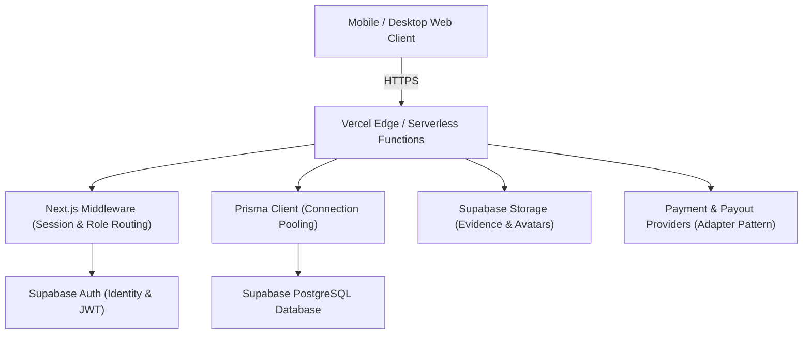

# AFRIX Architecture Overview

AFRIX is a full-stack Pan-African digital work marketplace built on Next.js 15+ App Router, TypeScript, Prisma ORM, Supabase PostgreSQL, Supabase Auth, and Supabase Storage. The entire application is architected specifically for zero-infrastructure deployment directly to Vercel without requiring persistent Node servers, Docker, Redis, Celery, or Django.

## Architectural Principles

1. **Direct Vercel Serverless Execution**:
   - Every API endpoint is implemented as a standard Next.js Route Handler (`/app/api/.../route.ts`).
   - Long-running scheduled tasks are executed as serverless endpoints protected by a `CRON_SECRET` and scheduled via Vercel Cron (`vercel.json`).
   - No filesystem-dependent state; persistent files are stored directly in Supabase Storage with signed private URLs.

2. **Immutable Financial Ledger**:
   - Worker and enterprise balances are never modified with direct updates.
   - All financial operations (`TASK_REWARD`, `WITHDRAWAL`, `WITHDRAWAL_REVERSAL`, `REFERRAL_REWARD`) must create an immutable row in the `LedgerTransaction` table within a Prisma `$transaction`.
   - Exact decimal precision (`Prisma.Decimal`) is used across all models to prevent floating-point inaccuracies.
   - Idempotency keys prevent double crediting or duplicate withdrawals.

3. **Adapter Pattern for Payouts & Payments**:
   - Defined `PaymentProvider` and `PayoutProvider` interfaces.
   - Development ships with `MockPaymentProvider` and `MockPayoutProvider` for complete local testing without real money.
   - Production can configure third-party fiat or stablecoin settlement gateways via environment variables without altering core ledger logic.

4. **Multi-Role Separation & Server-Side Authorization**:
   - `WORKER`: Complete microtasks, build XP & levels, earn rewards, request cashouts.
   - `BUSINESS`: Fund campaigns, build custom submission forms, inspect evidence, review and approve worker submissions.
   - `ADMIN`: Global oversight of users, consensus audits, fraud scoring, ledger inspection, and withdrawal approvals.

