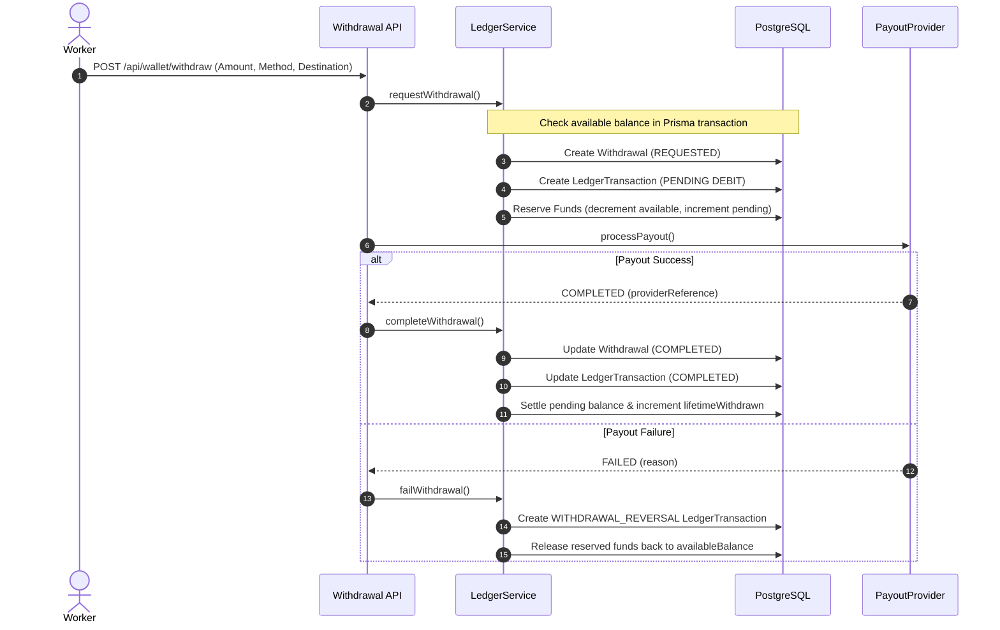

# Payments & Payouts Architecture

AFRIX utilizes an **Adapter Pattern** for all incoming payments (enterprise campaign funding) and outgoing payouts (worker withdrawals).

## 1. Provider Interfaces

The platform defines clean TypeScript abstractions in `lib/payments/types.ts`:
- `PaymentProvider`: Used by businesses to deposit campaign budgets into platform escrow.
- `PayoutProvider`: Used to transfer worker earnings to African bank accounts, Mobile Money (M-Pesa, MTN MoMo, Airtel Money), or stablecoins (USDT/USDC).

## 2. Environments

### Development: `MockPaymentProvider` & `MockPayoutProvider`
- In development and local testing, mock adapters simulate instantaneous funding and payout settlement without real money or third-party API dependencies.
- Allows 100% test coverage and end-to-end user journeys locally.

### Production Adapters
Production adapters can be plugged in by implementing `PaymentProvider` or `PayoutProvider`:
- **African Fiat Gateways**: Paystack, Flutterwave, Korapay (Nigeria, Kenya, Ghana, South Africa).
- **Mobile Money Direct APIs**: Safaricom Daraja (M-Pesa Kenya), MTN MoMo API (Uganda, Ghana).
- **Stablecoins (Phase 2)**: Third-party non-custodial or compliant institutional payout providers.

## 3. Worker Withdrawal Flow

